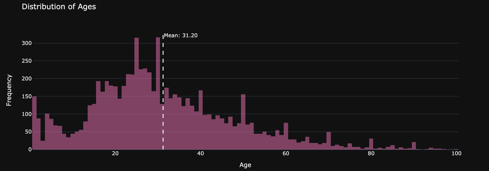

# Age Prediction Model

## Table of Contents
1. [Introduction](#introduction)
2. [Goal](#goal)
3. [Key Findings](#key-findings)
4. [Data](#data)
5. [Process](#process)
6. [Assumptions](#assumptions)
7. [Alternative Uses](#alternative-uses)
    - [Product Placement](#product-placement)
    - [Supplier Marketing](#supplier-marketing)
8. [Run Application](#run-application)
9. [Installation](#installation)
10. [Quick Start Guide](#quick-start-guide)

## Introduction

Traditionally, the alcohol age verification process often acquires slow and sometimes inaccurate manual checks for identification. As cameras are located by the checkout area, the need for an employee to check a customer's identity may be replaced given the right model. Check out the [full notebook](python/good-seed.ipynb) and the [demo](https://www.loom.com/share/0479696709ec4e639a444299bf855180?sid=61dad59e-d590-471e-9b85-a563637bd5e9).

## Goal
Develop a model that identifies the age of a customer based on their portrait photo. Aim for a mean absolute error on the test set below 8.0 years.

## Key Findings
The model:
- Eliminates the need to manually identify the age of over half of all customers purchasing alcohol (if results are replicated and assumptions are correct).

- Predicts ages within 6.1 years of a person's actual age on average.

- Produces an F1 score of 0.89 with a precision of 0.82, outperforming constant models.

## Data

7.5k photos with accompanying ages was used. A diverse distribution of ages represented those from 1-100. 



## Process

1. **Prepare Data**
    - Initialize packages
    - Load data
    
2. **Exploratory Data Analysis**
    - Assess distribution

3. **Run Model**
    - Load train data (ImageDataGenerator)
    - Load test data (ImageDataGenerator)
    - Create model (ResNet)
    - Train model

4. **Draw Conclusions**
    - Evaluate the model's effectiveness
    - Assess resource-saving potential

## Assumptions
- The age distribution of customers who purchase alcohol is similar to the general customer age distribution.
- The median age of customers is 44 years, according to this [article](https://adplanetads.com/spotlight/grocery-shopper-demographics-retail-dooh/#:~:text=Age%3A%20The%20average%20age%20of,their%20own%20ways%20of%20shopping.).

## Alternative Uses

### Product Placement

Grocery stores could identify which products are bought by each age group. For instance, products frequently purchased by elderly customers could be placed closer to the front for easier access, incentivizing them to shop at this store over others.

### Supplier Marketing

This information can also help suppliers identify their target audiences. Stores could sell this data and charge for specific shelf placements based on customer preferences.

## Installation

1. Clone the repository:
   ```sh
   git clone https://github.com/your-repo/age-prediction-model.g
   ```

2. Navigate to project directory:
   ```sh
    cd age-prediction-model
    ```

3. Install required packages
    ```sh
    pip install -r requirements.txt
    ```

4. Run the Streamlit application
    ```sh
    streamlit run python/app.py
    ```
